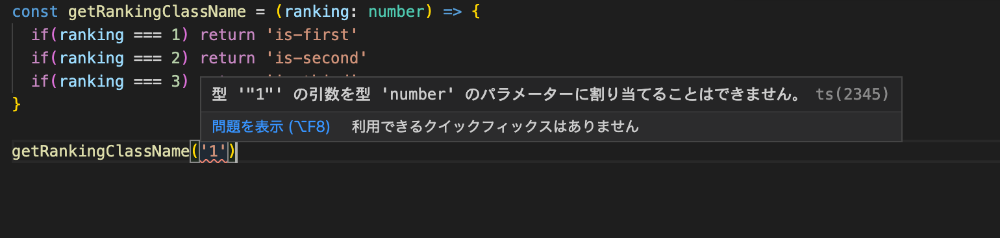
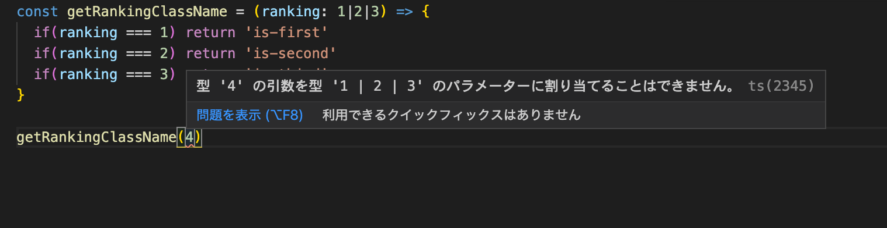
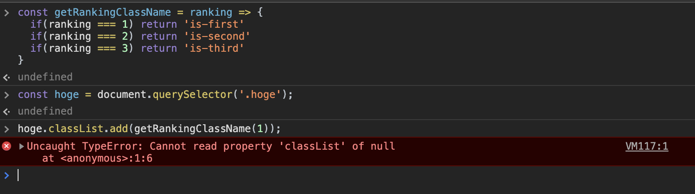
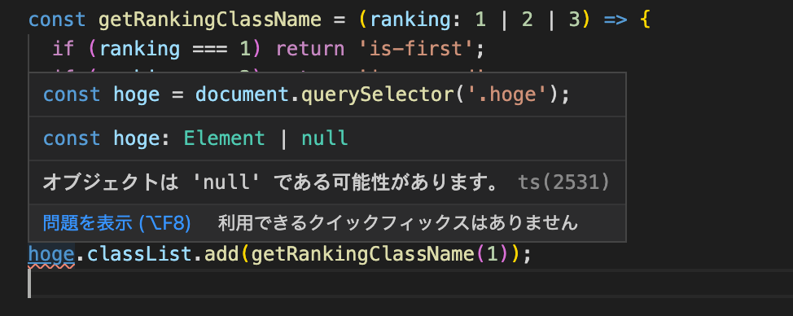
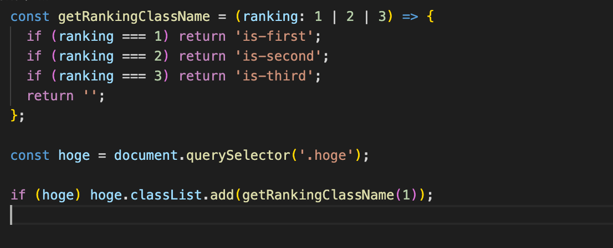

社内のJSに自信がないメンバーから、TypeScriptを使うべきか・いいところはどんなところかという質問上がりました。

結論から言えばどんな場合でもTypeScriptで書く方がいいと思っています。ですが、経験値や熟練度によってその理由にピンとこない人も多いのではないでしょうか。

JavaScriptが苦手なのにTypeScriptなんて無理と思うかもしれませんが、個人的にはJSに自信がなく、苦手でちゃんと動くか心配に感じている人ほどTypeScriptの恩恵を受けられるのでは？、と思っている部分があるのでその理由を書いていきます。

対象読者はjQueryでサイトを構築してきた & JavaScriptの実装経験があまりないフロントエンドエンジニアおよびコーダーです。（ReactやVueなどのモダンフレームワークを使ってゴリゴリ実装している人は対象ではありません）

## 1番多いJavascriptのエラーは？

TypeScriptの話に行く前にアイスブレイクです。

何かの本か記事で、プログラムで1番多いバグはNullアクセスの例外って書いてありました。JavaScriptでいえば、`Cannot read property ‘property_name’ of null` `Cannot read property ‘property_name’ of undefinde`とかですね。自分の会社のrollbarを見ていても、上記の二つが一番多いです・・

慣れている人なら回避方法がすぐ浮かぶかもしれませんが、経験値によってはそうもいかないことがあると思います。

TypeScriptを使用すると、Nullやundefindeの可能性があるコードはエディター&コンパイル時にエラーが出ます。これによりバグ発生率を下げることができます。

## JSに自信がない人こそTypeScriptを使って欲しい理由

本題です。

TypeScriptのメリット以下だと思っています。

* 型による可読性の向上
*   〃   エラー検知のしやすさ
* Null安全性

型があることで可読性が上がりますが、これはある程度JavaScriptに慣れ、コードを読んでいなければ実感できないでしょう。

個人的にJavaScriptに自信がない・苦手意識ある人こそ得られる恩恵は*「エラーが検知しやすい & Null安全性」*だと思います。

ここからは普通のサイト？（jQueryで事足りるサイト・ReactやVueを使う必要ないサイト）でよくありそうなコードをもとに解説していきます。

### エラーが検知しやすい

型があることでエラー検知しやすくなります。

例えば以下は順位（数字）に適したクラスを返すメソッドです。

```javascript
const getRankingClassName = ranking => {
  if(ranking === 1) return 'is-first'
  if(ranking === 2) return 'is-second'
  if(ranking === 3) return 'is-third'
  return ‘’;
}

getRankingClassName(1) // ‘is-first’
getRankingClassName(2) // 'is-second'
getRankingClassName(3) // 'is-third'

getRankingClassName(4) // 空の文字列
getRankingClassName(‘1’) // 空の文字列
```

引数`ranking`はNumber型を期待しており、間違って数字を文字列で渡した場合は空の文字列が返ってきます。こういうのは思わぬバグにつながります。

TypeScriptを使用し、引数`ranking`にNumber型を指定すると、Number型以外の引数は全てエラーになります。



さらに厳密にしたい場合は1|2|3しか受け付けないunion型にします。これで1|2|3以外の数値でもエラーになるようになりました。



### Null安全性

上記の`getRankingClassName`メソッドを使ってクラスを付与してみましょう。以下のようにやる付与できます。

```javascript
const hoge = document.querySelector('.hoge');
hoge.classList.add(getRankingClassName(1)); // ‘is-first’ が付与される
```

ですが上記のコードの場合、`.hoge`が存在していないと`Cannot read property ‘classList’ of null`のエラーになります。



Javascriptで書いた場合、エラーに気づくのはブラウザで該当処理が実行された時です。
ですが大半の場合、`.hoge`が存在している前提で実装していると思うので、エラーに気がつくのは実装時より後か（他の画面を実装している時とか）、最悪気が付かないってこともあるでしょう。

TypeScriptを使用した場合、以下のようにエラーが出ます。



`querySelector`はElementとnullの型を持つunion型です。Type Guard or Type assertionsを利用しエラーを回避しないとコンパイルが通りません。

ただ、Type assertionsは強制的に既存の型を書き換えてしまい、TypeScriptの恩恵が受けられなくなるので極力使用しない方がいいでしょう。

上記のコードの場合、強制的にElement型のみにしてしまうと、`.hoge`を削除した場合、実際にブラウザで動かすまでエラーに気がつきません。その点Type Guardで回避しておけば、`.hoge`のあるなしにかかわらず振る舞いが変わりません。



アイスブレイクで書いたように意図しないNullはエラーの原因になります。TypeScriptを使うことで上手にエラーを回避することができるでしょう。

## まとめ

普通のサイトでよくありそうな処理をもとに解説してきました。身に覚えのあるエラーがあったのではないでしょうか？

もちろんTypeScriptの恩恵は上記の例だけではありません。

ReactやVueなどのモダンフレームワークを使用しSPAを作成するときはさらにメリットを感じられると思います。（状態管理・非同期処理のインターフェイス・propsなどなど）

JavaScriptが苦手なのにTypeScriptまで覚えられないと思うかもしれませんが、TypeScriptはJavaScriptの上位互換であり、7割くらいの機能はJavaScriptと同じです。設定次第ではゆるゆるんいできるので、いきなりTypeScriptから入るのもいいと思っています。

本記事でメリットを感じられたらぜひTypeScriptからチャレンジしてみるといいと思います。
